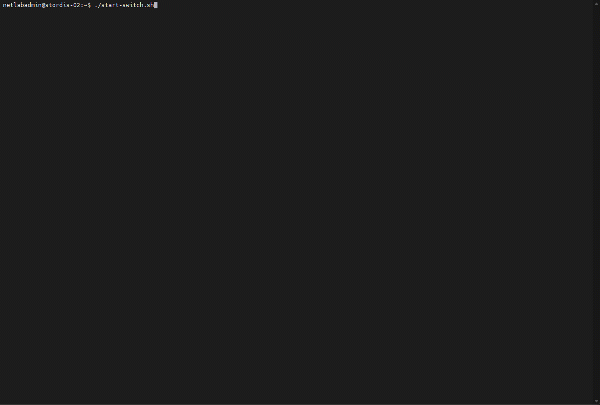
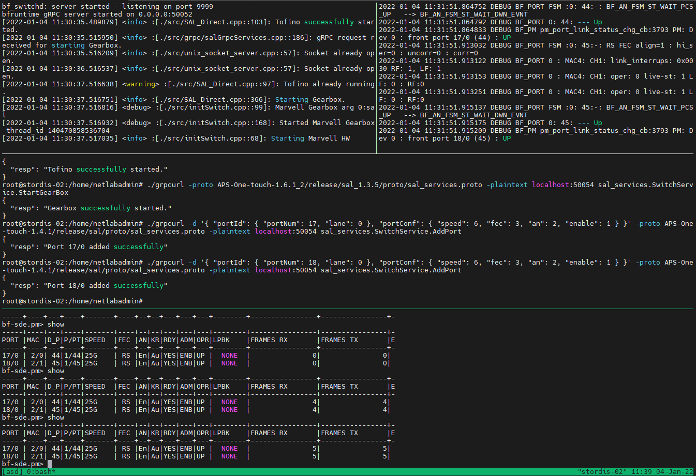

# APS Switch Dashboard



tmux script to initialize and operate AWS switches like the BF2556X-1T. Still work in progress. The dashboard can be taylored to your needs using tmux commands. In the default form it will include a pane that runs SAL to start SDE/BSP. A second pane that shows the logging output of SAL/SDE/BSP. A third pane that runs the initialization commands for the switch (esp. starting Marvell Gearbox to bring up the ports) and afterwards offers a shell. And finally a fourth pane that opens bfshell to interact with the SDE and underlying hardware, e.g., using bfrt_python, ucli etc.

The script can be used interactivey after the switch is booted and can run headless. Hence, it can also be started directly during the boot process using systemd. It starts a tmux session "asd" that can be accessed later using `sudo tmux attach -t asd`.

## Installation

Script expects Ubuntu 18.04 or 20.04 as well as APS One Touch (AOT) incl. Intel SDE and APS BSP/SAL to be already installed on the switch. See, e.g., APS support forum or https://github.com/APS-Networks/APS-One-touch for installation instructions. This repo also provides a rudimentary script for the steps to install AOT, SDE, BSP and SAL: [install-aot-sde-bsp-sal.sh](scripts/install-aot-sde-bsp-sal.sh). This will be improved and possibly included in the start script for the dashboard.

```sh
wget https://raw.githubusercontent.com/prona-p4-learning-platform/aps-switch-dashboard/master/start-switch.sh
chmod +x start-switch.sh
sudo apt install tmux
```

Install [gRPCurl](https://github.com/fullstorydev/grpcurl), e.g., by copying grpcurl binary directly to the directory where you downloaded start-switch.sh in the previous step:

```sh
wget https://github.com/fullstorydev/grpcurl/releases/download/v1.8.5/grpcurl_1.8.5_linux_x86_64.tar.gz
tar zxvf grpcurl_1.8.5_linux_x86_64.tar.gz
./grpcurl -version
```

Start the APS Switch Dashboard by running

```sh
./start-switch.sh
```

You can navigate in the dashboard using regular tmux commands/shortcuts like <kbd>CTRL</kbd>+<kbd>b</kbd> <kbd>UP</kbd>, <kbd>CTRL</kbd>+<kbd>b</kbd> <kbd>DOWN</kbd>, <kbd>CTRL</kbd>+<kbd>b</kbd> <kbd>PAGE UP</kbd> etc. Leave the dashboard, while keeping SAL etc. running, by detaching from the tmux session, e.g., using <kbd>CTRL</kbd>+<kbd>b</kbd> <kbd>d</kbd>. The script starts a tmux session "asd" that can be accessed later using `sudo tmux attach -t asd`.

See tmux manual or cheat sheet for further commands and possible customizations of the dashboard. 

Result should look similar to the following screenshot. In the upper left pane the start and output of AOT's `python3 sal.py` is shown. The pane to the right shows the corresponding BSP/hareware platform log output, e.g., showing low-level port and SFP changes. The pane in the middle is used to first send grpc commands to the SAL, esp. issuing the start of the Marvell Gearbox to be able to use the ports of the switch. later it can be used as a shell to interact with SDE etc. The lower pane is running bfshell, hence offering access to the SDE shell and underlying hardware configuration. The screenshot below is showing a scenario in which a simple "hello world"-like [pronarepeater.p4](https://github.com/prona-p4-learning-platform/p4-boilerplate/tree/main/Example1-Repeater) is used to forward traffic between front panel ports 17 and 18 (device ports 44 and 45 in pronarepeater.p4) of the switch. The lower bfshell pane shows the result of an ICMP ping being sent over these ports.



## Compiling your own P4 code

P4 programs that have been build in the SDE can be selected using p4_prog in settings.yaml file of AOT. To compile your P4 program you can find a description in the manual of the Intel SDE or use the script [p4-build-cmake.sh](scripts/p4-build-cmake.sh) that is provided in this repo.

```sh
./p4-build-cmake.sh pronarepeater # expects to have pronarepeater.p4 in the current directory
```

## Next steps

* example to compile p4 prog, using pronarepeater.p4 as a reference
* maybe complete example regarding the commands that need to be run after Ubuntu base OS is installed on the switch?
* examples to setup kpkt etc.
* possible enhancement: systemd units to start and monitor SAL, SDE, gRPC init etc.