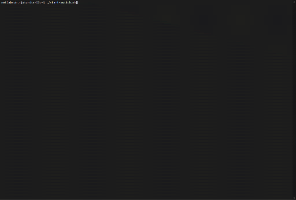
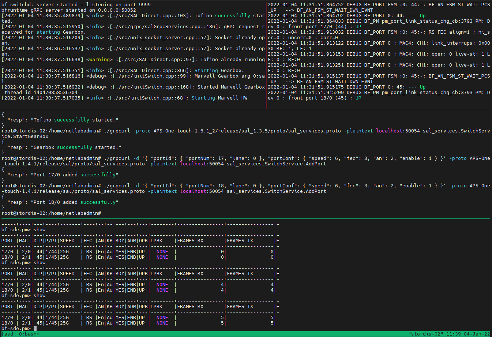

# APS Switch Dashboard



tmux script to initialize and operate AWS switches like the BF2556X-1T. Still work in progress.

## Installation

Script expects Ubuntu 18.04 or 20.04 as well as APS One Touch (AOT) incl. Intel SDE and APS BSP/SAL to be installed on the switch. See, e.g., APS support forum or https://github.com/APS-Networks/APS-One-touch for installation instructions.

```sh
git clone https://github.com/prona-p4-learning-platform/aps-switch-dashboard.git
sudo apt install tmux
```

Install grcurl, e.g. by copying grpcurl binary directly to the cloned repo directory:

```sh
wget https://github.com/fullstorydev/grpcurl/releases/download/v1.8.5/grpcurl_1.8.5_linux_x86_64.tar.gz
tar zxvf grpcurl_1.8.5_linux_x86_64.tar.gz
./grpcurl -version
```

Start the APS switch dashboard by running

```sh
./start-switch.sh
```

You can navigate in the dashboard using tmux commands like <kbd>CTRL</kbd>+<kbd>b</kbd> <kbd>UP</kbd>, <kbd>CTRL</kbd>+<kbd>b</kbd> <kbd>DOWN</kbd>, <kbd>CTRL</kbd>+<kbd>b</kbd> <kbd>PAGE UP</kbd> etc. Leave the dashboard while keeping SAL etc. running by detaching from the tmux session, e.g., using <kbd>CTRL</kbd>+<kbd>b</kbd> <kbd>d</kbd>. See tmux manual or cheat sheet.

Result should look similar to this:



## Next steps

* example to compile p4 prog using pronarepeater.p4
* exmaples to setup kpkt etc.
* possible enhancement: systemd units to start and monitor SAL, SDE, gRPC init etc.